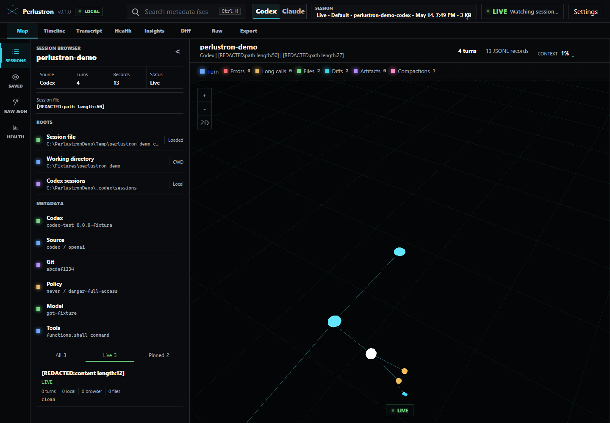

# Perlustron

Perlustron is a local-first agent-forensics workbench for Codex and Claude Code JSONL session logs. It turns raw logs into an interactive map, dense timeline, transcript, parser-health view, debugging insights, session diff, and redacted reports so developers can answer: what happened, where did the run drift, what failed or looped, and what is safe to share?

Perlustron does not upload prompts, source code, file paths, command output, images, or tool results. The default server binds to `127.0.0.1`, release UI assets are bundled locally, API routes require a per-run local token, and no telemetry is implemented.

Perlustron only shows data that exists in the log. It cannot recover hidden or unlogged model reasoning, and heuristic panels are labeled as heuristics.

## First 30 Seconds

```bash
perlustron --demo
perlustron path/to/session.jsonl
perlustron status path/to/session.jsonl
perlustron scan path/to/session.jsonl
perlustron export path/to/session.jsonl --format html --redacted -o report.html
```

Useful follow-ups:

```bash
perlustron diff run-a.jsonl run-b.jsonl
perlustron insights path/to/session.jsonl
perlustron unknowns path/to/session.jsonl --redacted -o unknowns-redacted.json
perlustron fixture-report path/to/session.jsonl --redacted -o fixture-report.md
```



The screenshot above was generated from the bundled sanitized Codex demo with privacy mode enabled. Do not use private logs for screenshots or marketing assets.

## Install

Download the latest release archive for your platform, verify its checksum, extract it, then run `perlustron --demo`.

Without GitHub CLI, open the repository's Releases page in a browser, download the archive and matching `.sha256` file for your platform, then use the verification commands below. The expected artifact names are:

- `perlustron-windows-x86_64.zip`
- `perlustron-linux-x86_64.tar.gz`
- `perlustron-macos-aarch64.tar.gz`
- `perlustron-macos-x86_64.tar.gz`

GitHub CLI is still convenient when available:

macOS:

```bash
gh release download --repo BearHuddleston/perlustron --pattern 'perlustron-macos-aarch64.tar.gz*'
shasum -a 256 -c perlustron-macos-aarch64.tar.gz.sha256
tar -xzf perlustron-macos-aarch64.tar.gz
./perlustron-macos-aarch64/perlustron --demo
```

Linux:

```bash
gh release download --repo BearHuddleston/perlustron --pattern 'perlustron-linux-x86_64.tar.gz*'
sha256sum -c perlustron-linux-x86_64.tar.gz.sha256
tar -xzf perlustron-linux-x86_64.tar.gz
./perlustron-linux-x86_64/perlustron --demo
```

Windows PowerShell:

```powershell
gh release download --repo BearHuddleston/perlustron --pattern 'perlustron-windows-x86_64.zip*'
Get-FileHash .\perlustron-windows-x86_64.zip -Algorithm SHA256
Get-Content .\perlustron-windows-x86_64.zip.sha256
New-Item -ItemType Directory -Force .\perlustron-unpacked | Out-Null
Expand-Archive .\perlustron-windows-x86_64.zip -DestinationPath .\perlustron-unpacked
.\perlustron-unpacked\perlustron-windows-x86_64\perlustron.exe --demo
```

Build from source:

```bash
npm ci
npm run build
cargo install --path .
perlustron --demo
```

Release archives include the binary, local UI assets embedded in the binary, bundled sanitized demo fixtures, licenses, `SECURITY.md`, and docs. Normal release use does not require Rust, Node, npm, CDN access, or network access.

macOS artifacts are signed and submitted for notarization when release secrets are configured. Unsigned developer-preview archives may require:

```bash
xattr -dr com.apple.quarantine perlustron
```

## Features

Implemented:

- Codex and Claude Code JSONL parsing with parser health for unknown and malformed data.
- Interactive local UI with three default modes: Map for the 3D workflow observatory, Timeline for compact chronological search, and Transcript for readable prompt/assistant/tool/result flow.
- Secondary Health, Insights, Diff, Raw, and Export utilities for parser diagnostics, debugging, comparison, source inspection, and shareable reports.
- Interactive Diff mode for selecting Run B, comparing two sessions in-app, opening divergence/event references, and exporting redacted JSON/HTML diff reports.
- Guided Insights mode with a "What should I inspect first?" queue over logged failures, repeated patterns, suspicious tools, context pressure, files, approval friction, and schema drift.
- Tool calls/results, file activity, summaries/compactions, token telemetry, embedded image references, MCP/web/search/subagent best-effort support.
- CLI status, scan, sanitize, export, diff, insights, unknowns, fixture-report, and benchmark commands.
- HTML, Markdown, and normalized JSON exports.
- Redaction profiles: `minimal`, `standard`, `strict`, and `structure-only`.

Partial:

- Claude file activity and token telemetry depend on logged shapes.
- MCP, web/search, and subagent support covers known shapes and reports drift through parser health.
- Diff divergence detection is a heuristic over normalized traces; it aligns comparable events and ignores timestamp-only/telemetry-only noise where possible.

Planned:

- More fixture coverage as Codex and Claude schemas evolve.
- Homebrew/tap publishing.
- More packaged macOS installer formats if needed for stapled notarization.

Repository About text is maintained manually in GitHub. Recommended text:

`Local agent-forensics workbench for Codex and Claude Code JSONL sessions: map, timeline, transcript, diff, insights, and redacted reports.`

## Core Commands

```bash
perlustron --help
perlustron --version
perlustron --demo --no-open
perlustron --demo claude
perlustron path/to/session.jsonl --source codex
perlustron status path/to/session.jsonl
perlustron scan path/to/session.jsonl
perlustron sanitize path/to/session.jsonl -o sanitized.jsonl --profile strict
perlustron export path/to/session.jsonl --format html -o report.html --redacted
perlustron export path/to/session.jsonl --format markdown -o report.md --redacted
perlustron export path/to/session.jsonl --format json -o normalized-trace.json
perlustron diff run-a.jsonl run-b.jsonl --format html --redacted -o diff.html
perlustron insights path/to/session.jsonl --format html --redacted -o insights.html
perlustron unknowns path/to/session.jsonl --redacted -o unknowns.json
perlustron bench --generate 10000
```

## Local And Private

- Default bind address: `127.0.0.1`.
- API routes require a random per-run local session token.
- No telemetry is implemented.
- Browser assets are local in release builds.
- Normal UI use makes no third-party browser requests.
- External images are not fetched; only embedded session images can be served.
- `--privacy-mode` serves strict-redacted graph data and disables image routes.

`scan`, `sanitize`, and redacted exports are best-effort sharing aids. Review before sharing.

## Documentation

- [Security](SECURITY.md)
- [Supported formats](docs/supported-formats.md)
- [Privacy and redaction](docs/privacy-and-redaction.md)
- [Session diff](docs/session-diff.md)
- [Insights](docs/insights.md)
- [Schema drift](docs/schema-drift.md)
- [Architecture](docs/architecture.md)
- [Fixtures](docs/fixtures.md)
- [Release](docs/release.md)
- [v0.2.0 release checklist](docs/release-checklist-v0.2.0.md)
- [v0.2.0 release notes draft](docs/release-notes-v0.2.0.md)
- [Benchmarks](docs/benchmarks.md)
- [Contributing](docs/contributing.md)

## Development

```bash
npm ci
npm run build
npm run check
npm run bench:smoke
```

Frontend source lives in [src/frontend/app.ts](src/frontend/app.ts). Rebuild `static/app.js` after TypeScript edits:

```bash
npm run build:frontend
```

For live frontend iteration in a debug checkout, run the server with disk-backed assets:

```bash
npm run dev
```

The `--dev-assets` server mode is debug-only and serves only `static/index.html`, `static/app.js`, and `static/styles.css` from disk with `no-store`. Normal release builds continue to use embedded offline assets.

## License

Perlustron is dual licensed under `MIT OR Apache-2.0`, at your option. See [LICENSE-MIT](LICENSE-MIT) and [LICENSE-APACHE](LICENSE-APACHE).
